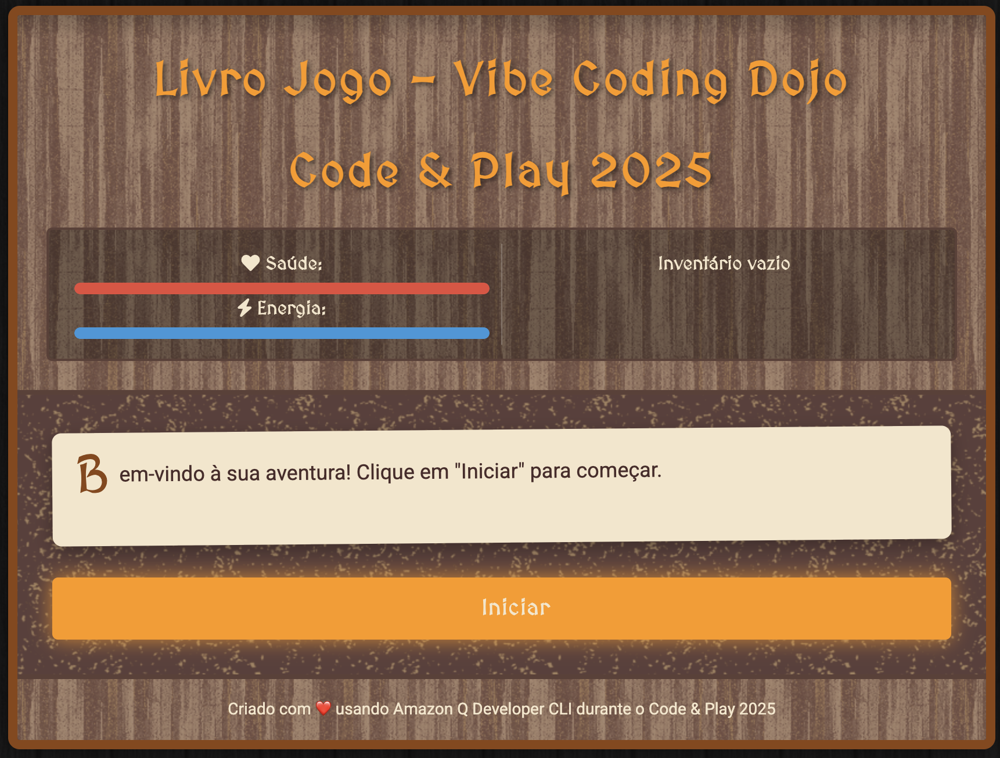
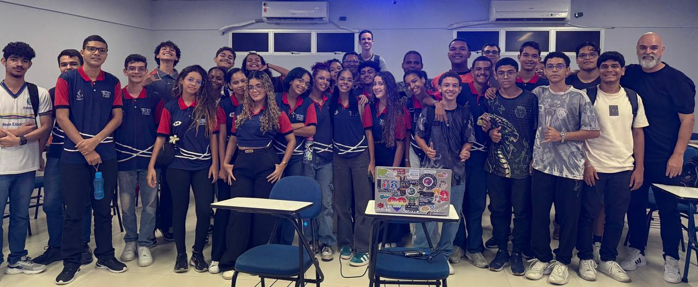
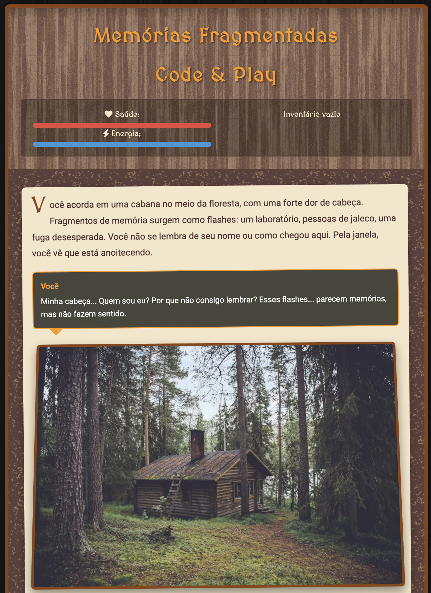

# Livro Jogo - Vibe Coding Dojo durante o Code & Play

Este projeto é um livro-jogo interativo desenvolvido durante um Vibe Coding Dojo com [Amazon Q Developer CLI](https://bit.ly/amazon-q-dev-brasil) no Code & Play 2025. O objetivo é criar uma experiência de leitura não-linear onde o leitor pode tomar decisões que afetam o desenrolar da história.






## Estrutura do Projeto

- `index.html` - Estrutura da página web
- `styles.css` - Estilos e aparência visual
- `story.js` - Dados da história e estrutura das páginas/cenas
- `game.js` - Lógica do jogo e manipulação da interface

## Como Funciona

O livro-jogo é baseado em um sistema de páginas/cenas interconectadas. Cada página contém:

1. Um texto narrativo
2. Opcionalmente uma imagem
3. Um conjunto de escolhas que levam a diferentes páginas

O jogador também possui:
- Um inventário para itens coletados
- Estatísticas que podem mudar ao longo da história
- Um registro de páginas visitadas

## Como Expandir a História

Para adicionar novas páginas à história, edite o arquivo `story.js` e adicione novos objetos ao objeto `storyData`. Cada página deve seguir este formato:

```javascript
"id_da_pagina": {
    id: "id_da_pagina",
    title: "Título da Página",
    text: "Texto narrativo que aparece para o jogador...",
    image: "caminho/para/imagem.jpg", // opcional
    choices: [
        {
            text: "Texto da escolha 1",
            nextPage: "id_da_proxima_pagina_1",
            condition: { /* condições opcionais */ }
        },
        {
            text: "Texto da escolha 2",
            nextPage: "id_da_proxima_pagina_2"
        }
    ],
    effects: {
        // Efeitos opcionais que ocorrem ao chegar nesta página
        addItems: ["item1", "item2"],
        removeItems: ["item3"],
        modifyStats: { health: -10, energy: +5 },
        setFlags: { "encontrou_chave": true }
    }
}
```

## Como Executar

Abra o arquivo `index.html` em um navegador web para iniciar o jogo.

## Próximos Passos

Algumas ideias para expandir o projeto:
- Adicionar sons e música de fundo
- Implementar sistema de combate
- Criar um editor visual para a história
- Adicionar sistema de salvamento do progresso
- Implementar achievements/conquistas
